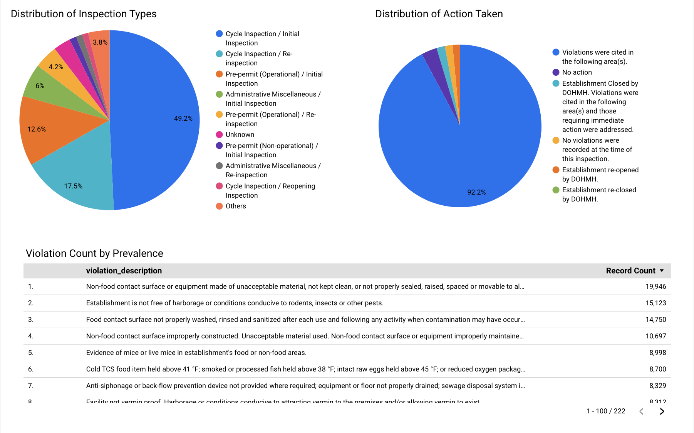

# New York City Restaurant Inspections Analysis

This project has been created as a way to solidify my knowledge after following the videos/documentation provided by the 
[DataTalksClub data engineering zoomcamp]. (https://datatalks.club/blog/data-engineering-zoomcamp.html) 

## Data Description

This data was obtained from the NYC OpenData [website](https://data.cityofnewyork.us/Health/DOHMH-New-York-City-Restaurant-Inspection-Results/43nn-pn8j/about_data)
Per the website, the data contains every violation citation from every full or special inspection for restaurants as well 
as college cafeterias for up to 3 years prior to their most recent inspection. 

Some notable information about the data includes:
* Some restaurants received more than one violation/inspection
* Only restaurants with a currently active status are included in the data
* Records are also included for restaurants that have applied for a permit, but has not yet been inspected
* There are also records included for restaurants that have not received a violation
* This data is updated daily.

## Project Objectives

The main objective of this project was to create a data pipeline, use the pipeline to load the data into a data warehouse, 
and finally, build a dashboard to visualize the data. 

Some questions that I would like to answer include:
*How many inspections and violations have been recorded?
*What are the most common violations?
*Do certain boros have more violations than one would expect based on population (violations per capita?
*What percentage of inspections result in a violation?
*What is the average inspection score by borough?

## Architecture Diagram

## Dashboard

The dashboard can be viewed [here] (https://lookerstudio.google.com/s/qtrdcmEoheA).

## Ideas for Improvement

Some ideas that I have for improving this project include:
*The code could be scheduled to run and refresh more frequently as data is added daily. 
*The tables/code in the data warehouse could be optimized to be structured more effeciently. 

##How to Reproduce This Project

Please note that these instructions are based on use of a MacOS. There may be some differences with use of Windows.

### Project set up

#### Infrastructure

Technologies used to create this project include:
*Docker (containerization)
*Terraform (infrastructure as code)
*GCP (data lake)
*BigQuery (data warehouse)
*Mage (orchestration)
*dbt (data transformation)
*Looker (data visualization)

#### Prerequisites

*Docker
*Terraform
*GCP Account

1. Clone this repository
2. Setup a new GCP Project
x. Create a project that has a unique name
x. Navigate to IAM & Admin>Service Accounts and select create a service account.  For ease of use, you can set the role 
    of this account as "Owner" or you could specifically select what services this account needs to access. In this case, the roles would 
    include: Storage Admin, Storage Object Admin, BigQuery Admin, and Compute Admin.
x. You can then go into the service account that you created, navigate to the "Keys" tab > "Create New Key" and then download 
    the key
x. You should then move a copy of your service key into the directory of your project in the terraform>keys folder.

#### Terraform

3. Edit terraform variables.tf file. You will need to change the default variables for project, region, and BQ_DATASET
4. Prepare working directory with terraform init

'''
terraform init
'''

5. Check execution plan to confirm changes are what you are expecting. 

'''
terraform plan
'''

6. Create the infrastructure.  This will build your GCS bucket and BigQuery Dataset

'''
terraform apply
'''

#### Mage

7. Prepare the .env file
8. Edit the .env file to reflect the same Project ID and bucket name that you have configured for Terraform. 
9. Build the Mage docker container using the command 
11. 
12. docker compose build in your terminal.
10. Start the docker container 
using the command docker compose up
11. Access the web interface at [http://localhost:6789 ](http://localhost:6789 )
12. Run the pipelines.  After Mage runs, you should see new datasets that have been stored within BigQuery.

#### DBT
13. Install dbt packages using the command dbt deps

14. Build the models using the command dbt build
15. Run the models using the command dbt run

#### Looker

13.  You should then be able to connect the BigQuery dataset created to Looker Studio and began creating your dashboard. 

